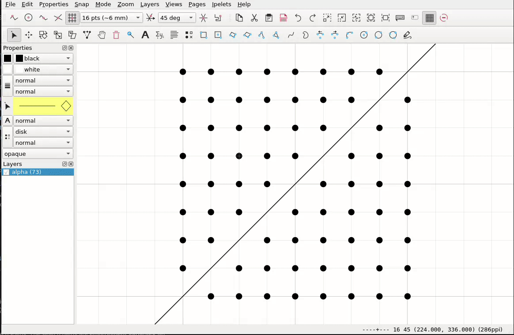
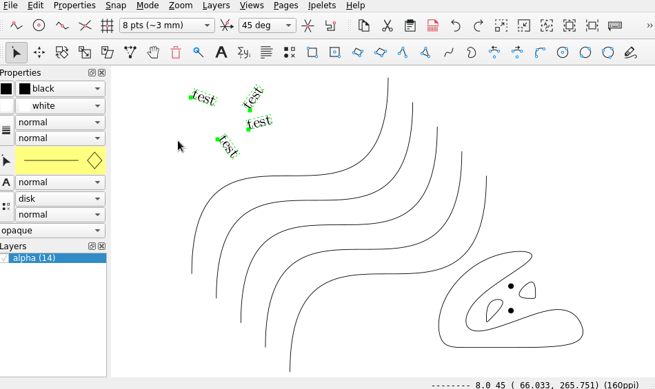
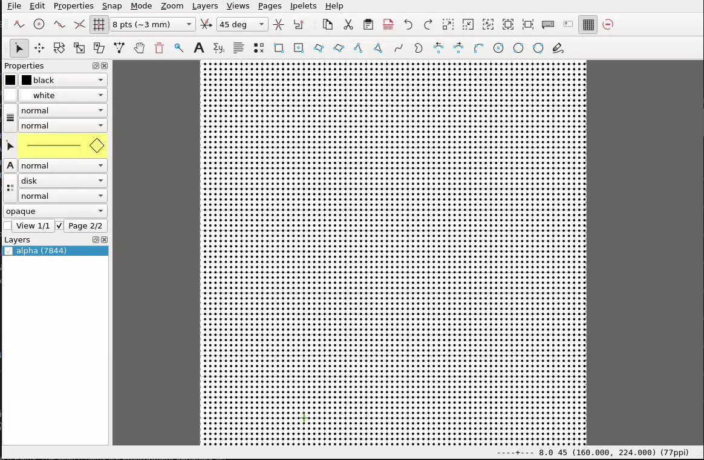

# Lasso Tool Ipelet

This Ipelet implements a Lasso Tool in [Ipe](https://ipe.otfried.org/).
The main difference to the normal, rectangular selection tool is that arbitrary selection polygons can be drawn. Furthermore, not the bounding boxes of objects are considered, but their actual geometry.

## Usage

Just start dragging the mouse to draw a selection polygon. If you release the mouse, the objects inside the polygon are selected.
Additive selection can be performed by holding the _shift_ key.

### Selection that cannot be performed by rectangular selection

(*Note: Ipe is not actual lagging, it's only the video produced by the capturing software...*)

### Correctly select different types of objects

(*Note: Ipe is not actual lagging, it's only the video produced by the capturing software...*)

### Select many objects at once

## Installation

Copy [lassotool.lua](lassotol.lua) to a location found by IPE.
Normally this is `~/.ipe/ipelets` for Linux and `%userprofile%\ipelets` for Windows (see Help->Show configuration).

## Technical Details & Lessons Learned

* The selection path of the Lasso is implemented as a closed polygon consisting of line segments
* To detect that a point lies within the polygon, a very simple [ray casting algorithm](https://en.wikipedia.org/wiki/Point_in_polygon) is used
* To detect that other objects (paths, arcs, ...) lie within the polygon, a search for intersections with the Lasso is performed. If there are no intersections AND one point of the object lies within the Lasso, the object is completely inside.
* To simplify the Lasso polygon, the very straightforward recursive [Ramer-Douglas-Peucker algorithm](https://en.wikipedia.org/wiki/Ramer%E2%80%93Douglas%E2%80%93Peucker_algorithm) is used
* The complexity of identifying whether an object is inside could be reduced by a [sweep-line algorithm](https://en.wikipedia.org/wiki/Bentley%E2%80%93Ottmann_algorithm), for example. However, the currently implemented bruteforce method was "good enough" for me (detection of over 30,000 objects takes less than 500ms on my computer)
* For speed up, only objects that are visible, not locked ~~and whose bounding box lies completely within the bounding box of the lasso polygon~~ are taken into account.
* For nested groups of objects, the transformation matrices have to be applied recursively
* The outline of an image object is not directly accessible. One option is to apply the inverse transformation matrix, get the bounding box and again apply the forward transformation.
* The outline of a text object is not directly accessible. One option is to calculate the outline based on the position, dimensions, alignment and transformation matrix
